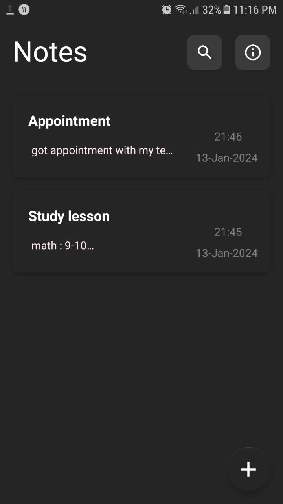
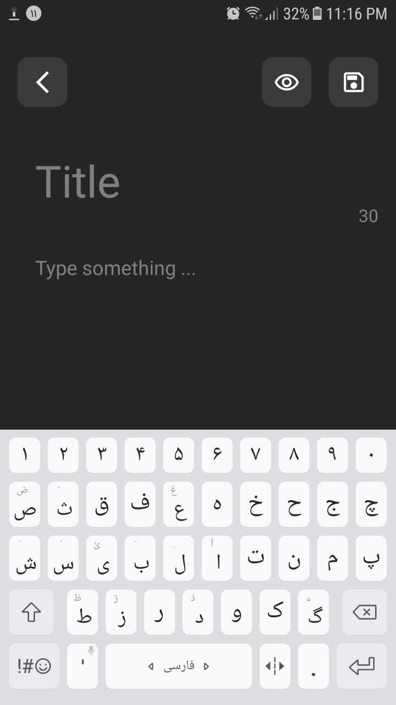
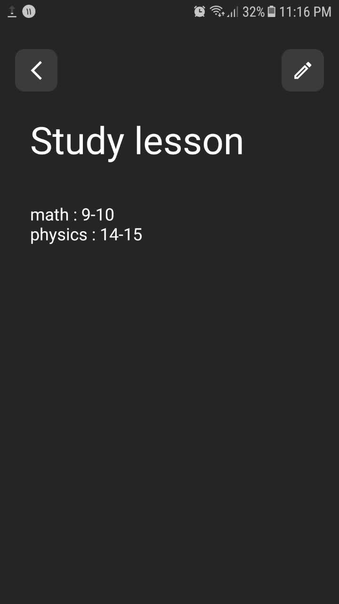

<!-- PROJECT SHIELDS -->
<!--
*** I'm using markdown "reference style" links for readability.
*** Reference links are enclosed in brackets [ ] instead of parentheses ( ).
*** See the bottom of this document for the declaration of the reference variables
*** for contributors-url, forks-url, etc. This is an optional, concise syntax you may use.
*** https://www.markdownguide.org/basic-syntax/#reference-style-links
-->

[![MIT License][license-shield]][license-url]
[![LinkedIn][linkedin-shield]][linkedin-url]

<!-- PROJECT LOGO -->
 

  

  <h3 align="center">MyNottie</h3>

  

    plan your day by taking your most important work in note!
     
     
    <a href="https://screenpal.com/watch/cZV2jXVJ1Gj">View Demo</a>
    ·
    <a href="https://github.com/mahdihassani-dev/SimpleNoteApp/issues">Report Bug</a>
    ·
    <a href="https://github.com/mahdihassani-dev/SimpleNoteApp/issues">Request Feature</a>
  

<!-- TABLE OF CONTENTS -->

  
Table of Contents

  <ol>
    <li>
      <a href="#about-the-project">About The Project</a>
      <li><a href="#contact">Contact</a></li>
  </ol>

<!-- ABOUT THE PROJECT -->
## About The Project
this is my first android project, a note app by which i learned some basic skills in android developing like
working with database, design layouts in xml with material design system and mvp architecture 

(<a href="#readme-top">back to top</a>)

<h3 align="center">Screenshots :camera:</h3>

  <table>
    <tr>
      <td align="center">
        
      </td>
      <td align="center">
        
      </td>
      <td align="center">
        
      </td>
    </tr>
  </table>

<!-- Technologies I used -->
## Technologies I used
#### Material Design System:
[![Product Name Screen Shot][materialDesign-pic]](https://m3.material.io/)
 
a popular desigin system which give you a pleasant and simple design with beautiful components. 
 
#### Room database:
[![Product Name Screen Shot][roomDatabase-pic]](https://developer.android.com/training/data-storage/room)
 
The Room persistence library provides an abstraction layer over SQLite to allow fluent database access while harnessing the full power of SQLite
 
#### MVP Architecture:
[![Product Name Screen Shot][mvp-pic]](https://www.geeksforgeeks.org/mvp-model-view-presenter-architecture-pattern-in-android-with-example/)
 
model-presenter-view architecture as you see in the picture.in this project i got one presenter called mainPresenter which override interfaces in mainScreenContrct
to make connection between view and model layer.

<!-- CONTACT -->
## Contact

email : m.hassani4951383@gmail.com

Project Link: [https://github.com/mahdihassani-dev/SimpleNoteApp](https://github.com/mahdihassani-dev/SimpleNoteApp)

(<a href="#readme-top">back to top</a>)

<!-- MARKDOWN LINKS & IMAGES -->
<!-- https://www.markdownguide.org/basic-syntax/#reference-style-links -->
[license-shield]: https://img.shields.io/github/license/othneildrew/Best-README-Template.svg?style=for-the-badge
[license-url]: https://github.com/mahdihassani-dev/SimpleNoteApp/blob/main/LICENSE
[linkedin-shield]: https://img.shields.io/badge/-LinkedIn-black.svg?style=for-the-badge&logo=linkedin&colorB=555
[linkedin-url]: https://www.linkedin.com/in/mahdi-hassani-939602255/
[materialDesign-pic]: images/materialDesign.png
[roomDatabase-pic]: images/room_architecture.png
[mvp-pic]: images/MVPSchema.png
